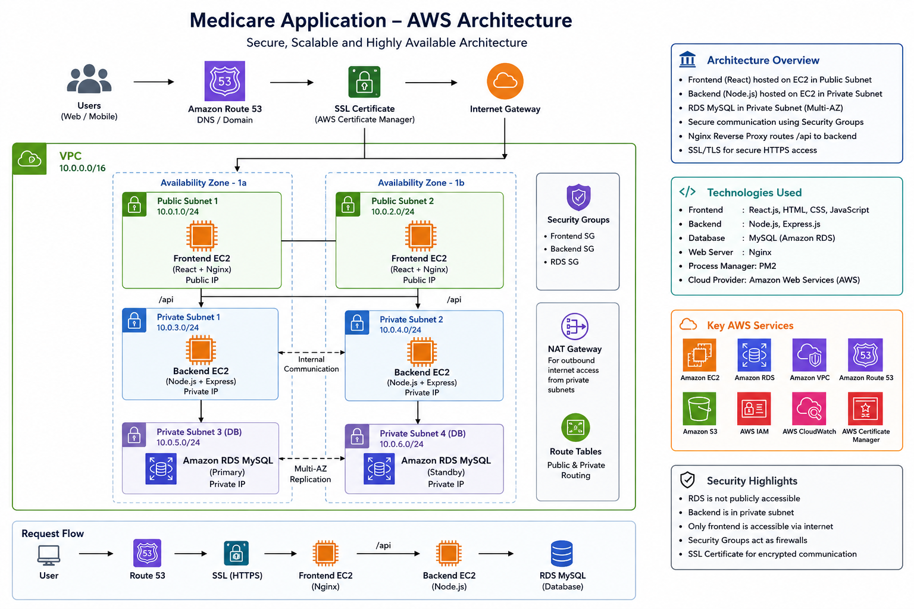

# 🏥 Medicare - AWS Full Stack Deployment Project

A full-stack healthcare web application deployed on AWS using secure cloud architecture.

---

# 🚀 Features

- User Authentication
- Medicine Catalog
- Blood Bank Module
- Order Management
- Chatbot Support
- Responsive Frontend

---

# ☁️ AWS Services Used

| Service | Purpose |
|---|---|
| EC2 | Host frontend & backend |
| RDS MySQL | Managed database |
| VPC | Secure networking |
| Public & Private Subnets | Network isolation |
| Security Groups | Firewall rules |
| Nginx | Reverse proxy |
| PM2 | Node.js process manager |
| Route53 | Domain & DNS |
| Certbot SSL | HTTPS security |

---

# 🏗️ AWS Architecture



---

# 🔐 Secure Architecture

- Frontend deployed in Public Subnet
- Backend deployed in Private Subnet
- Database deployed in Private Subnet
- Backend accessed through Nginx Reverse Proxy
- RDS not publicly accessible

---

# 📂 Tech Stack

## Frontend
- React.js
- Axios
- CSS

## Backend
- Node.js
- Express.js
- MySQL2
- PM2

## Database
- MySQL (Amazon RDS)

---

# ⚙️ Deployment Steps

## 1. Create VPC

- Public Subnet
- Private Subnet
- Internet Gateway
- NAT Gateway

---

## 2. Launch EC2 Instances

### Frontend EC2
- Ubuntu
- Nginx
- React Build

### Backend EC2
- Ubuntu
- Node.js
- Express.js
- PM2

---

## 3. Setup RDS MySQL

- Create MySQL database
- Configure security groups
- Import schema.sql

---

## 4. Configure Reverse Proxy

```nginx
location /api/ {
    proxy_pass http://PRIVATE_IP:3000/;
}
```

---

## 5. SSL Setup

```bash
sudo certbot --nginx -d yourdomain.com
```

---

# 📸 Architecture Diagram


---

# 📌 Learning Outcomes

- AWS Cloud Architecture
- Networking & VPC
- Reverse Proxy
- Secure Backend Deployment
- Database Management
- Linux Server Administration
- Full Stack Deployment

---

# 👨‍💻 Author

Arun Jadhav

---

# ⭐ Future Improvements

- Docker Deployment
- Kubernetes
- CI/CD Pipeline
- Auto Scaling
- Load Balancer
- CloudFront CDN
